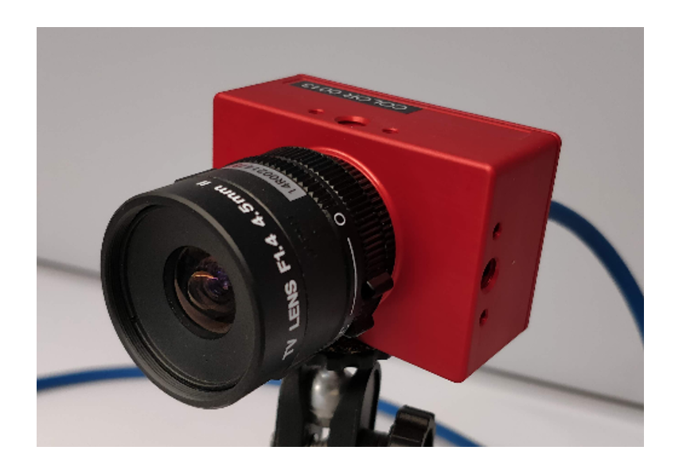
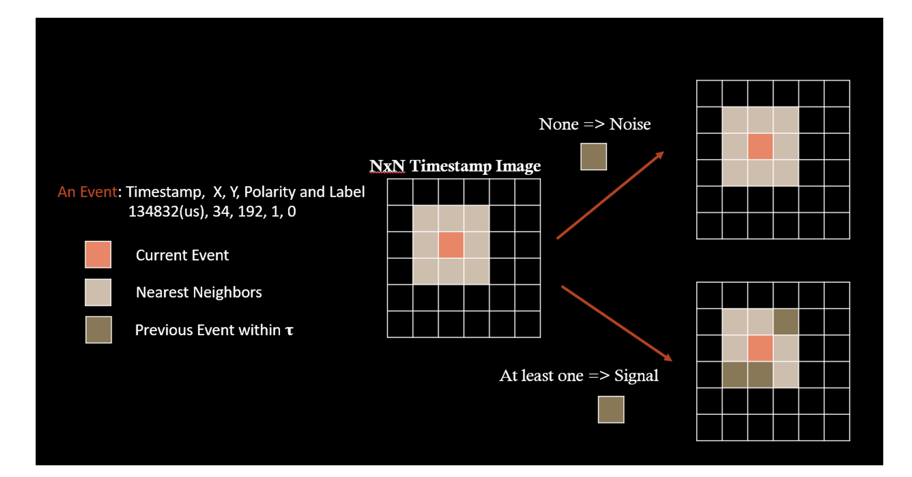
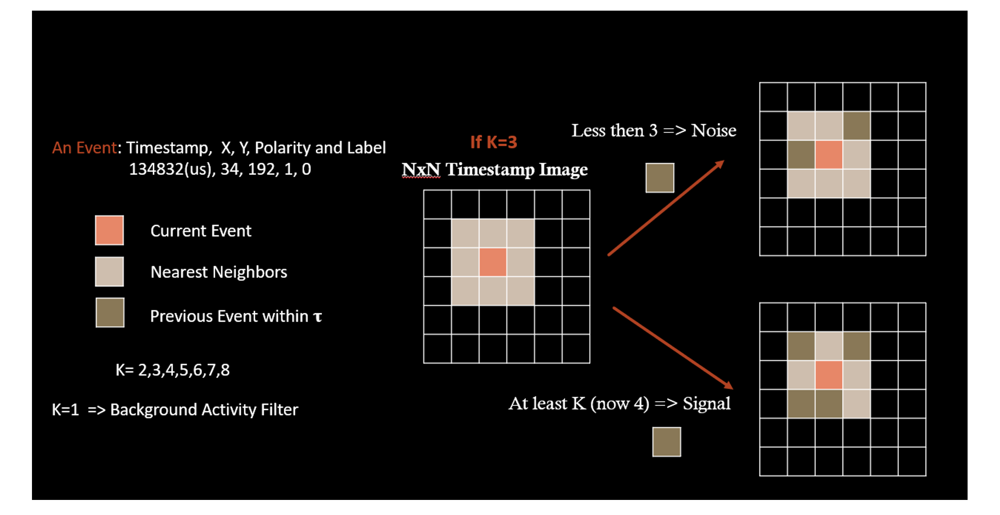
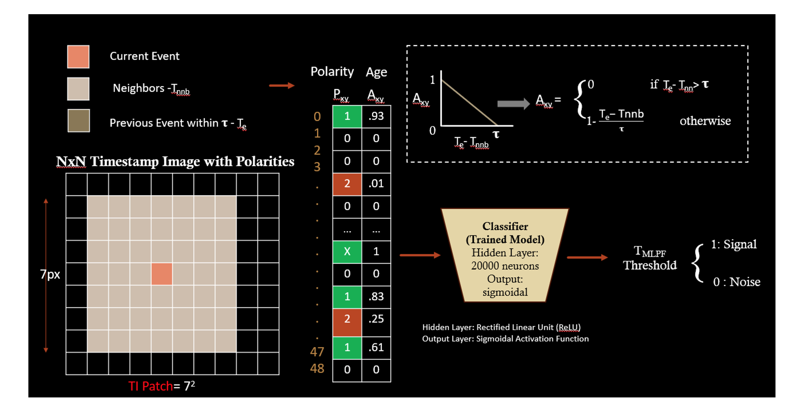
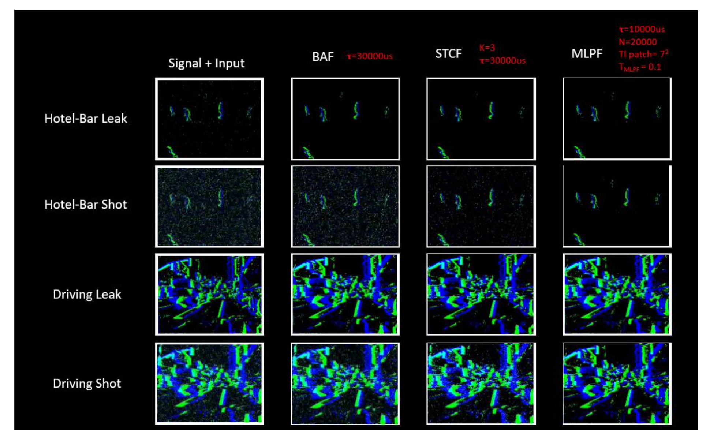

# Background Activity Denoising for Event Camera

## Abstract
Background activity (BA) noise events from Dynamic Vision Sensor (DVS) event cameras are uninformative and grow substantially in low-light conditions. While there are noises, it possibly results in problems including event overload and system instability, which would affect the efficiency and accuracy. Higher noise rate possibly renders existing denoising techniques ineffective. Moreover, comparing algorithm accuracy quantitatively is challenging. 

This research would measure filtering performance by using known combinations of signal and noise DVS events to better quantify denoising techniques. Three low-cost filtering algorithms are compared using datasets for stationary and moving camera applications of DVS. 

Algorithm 1 eliminates the majority of the BA noises by using a small fixed size window to measure the time difference between current event and previous events. 

For more thorough correlation verification, Algorithm 2 improves correlation checking that is proportional to the quantity of pixels. It preserves more signal while removing more noise in comparison to current approaches. 

To obtain the better accuracy across datasets, Algorithm 3 makes use of a lightweight multilayer perceptron classifier that depends on local event time surfaces and it has overall best performance comparing the previous two algorithms.

## Background

### DAVIS 346 Event Camera
The DAVIS 346 event camera is an innovative and proficient event-based vision sensor created by iniLabs, a prominent supplier of event-based sensing systems. The DAVIS (Dynamic and Active-pixel Vision Sensor) series signifies a notable progression within the domain of event cameras.

Figure1 DAVIS 346 Event Camera

### Background Activity Noises in Event Camera
Leak noises and shot noises are two forms of undesired signals that should be filtered out since they might have an impact on the precision and dependability of event-based systems. 

## The Output of Event Camera
For conventional cameras, it produces sequences of signal frames containing complete pixel information at regular intervals. Unlike conventional cameras, event cameras capture signals by detecting the brightness changes and encode the time. Thus, the output of event cameras is called Events. Event cameras asynchronously output events, which means it generates signal outputs based on local changes in pixel intensity in real time.

*Figure1 The Comparison of Signal Outputs between Event Cameras and Conventional Cameras*

Data Format of Each Event:
•	Event Coordinates: The X and Y coordinates of the pixel to indicate the location that the event occurred.
•	Event Polarity: A binary value (0 or 1) indicating whether the event is ON event or OFF event. The pixel experiencing an increase in intensity is an ON event and a decrease in intensity is an OFF event.
•	Event Timestamp: The timestamp is the time while the event occurred and the unit of timestamp is usually in microseconds.

## Algorithm Explanation

### Algorithm 1 - The Background Activity Filter (BAF)
The BAF functions by analysing the behavioural patterns of adjacent events and deciding as to whether the present event may be categorized as a signal or as a component of the background activity. The successful differentiation of significant events from noise is achieved by the BAF via the use of the concepts of time differences and correlation time.

Upon the occurrence of an event inside the camera's visual range, the Behaviour Analysis Framework commences its analysis by considering the temporal dimensions of the event. The primary emphasis is on the event's nearest neighbours, which refer to the events that are geographically in closest proximity to it. Through the analysis of these adjacent occurrences, the BAF seeks to discern patterns and associations within the temporal realm.

*Figure2 The Background Activity Filter (BAF)*

### Algorithm 2 - The Spatiotemporal Correlation Filter (STCP)
The STCF and the Background Activity Filter (BAF) have a same operational principle, which involves analysing the temporal intervals between the present event and its closest neighbouring events. In contrast to the BAF, which primarily focuses on the actions of individual neighbours, the STCF takes into account the combined behaviour of several neighbours in order to arrive at its conclusion.

*Figure3 The Spatiotemporal Correlation Filter (STCP)*

### Algorithm 3 - The Multilayer Perceptron Denoising Filter (MLPF)
In order to investigate the potential improvement in denoising accuracy, we have devised a Deep Neural Network (DNN) denoiser using a basic Multilayer Perceptron (MLP) architecture[11]. The objective is to assess the performance of a lightweight classifier trained on annotated data.

*Figure4 The Multilayer Perceptron Denoising Filter (MLPF)*

## Result

*Figure5 The Result of BAF, STCP and MLPF for Comparison*
The use of three algorithms, namely STCF, BAF, and MLPF, is viable for the purpose of filtering leak sounds. It is evident that all three algorithms exhibit satisfactory performance in this aspect, but with potential variations in their individual performance characteristics. Conducting a more extensive examination and comparison of the algorithms' performance, specifically in relation to metrics such as true positive rate, false positive rate, and other pertinent measurements, would provide a full comprehension of their respective merits and limitations.

In the context of filtering shot noises, it has been determined that the STCF algorithm exhibits superior performance in comparison to the BAF method. This implies that the STCF algorithm exhibits more efficacy in discriminating shot sounds from signals, hence yielding a reduced incidence of false positives.
According to the result, it can be concluded that the MLPF algorithm exhibits the most superior performance when compared to the other two filtering algorithms in terms of overall effectiveness. The Multi-Layer Perceptron Filter (MLPF) has superior performance in terms of filtering efficacy when compared to both the Short-Time Fourier Transform Filter (STCF) and the Bandpass Adaptive Filter (BAF), taking into account the mitigation of both leak sounds and shot noises.

